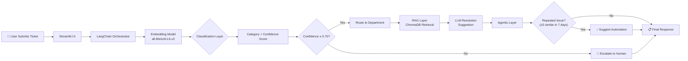

# AI-Powered Intelligent Ticket Routing & Resolution Agent
## Hackathon Engineering Roadmap (48 Hours)

---

## 1. System Architecture & Tech Stack

### High-Level Architecture Flow



### Tech Stack (All Free / Open-Source)

| Layer | Tool | Why This One |
|---|---|---|
| **LLM** | **Groq API** (free tier: Llama 3.1 70B) or **Ollama** (local Llama 3.1 8B) | Groq = fastest inference API on earth, free tier generous. Ollama = offline fallback |
| **Embeddings** | **`all-MiniLM-L6-v2`** via `sentence-transformers` | 80MB, runs on CPU in <50ms, 384-dim vectors. Best speed/quality ratio for hackathon |
| **Vector DB** | **ChromaDB** (in-process, no server) | `pip install chromadb`, zero config, persistent storage, metadata filtering |
| **Orchestration** | **LangChain** | Chains for classification + RAG retrieval + agentic routing in <100 LOC |
| **Classifier** | **Cosine similarity on embeddings** (primary) + **LLM zero-shot** (fallback) | No training needed. Embeddings give you confidence scores natively |
| **Frontend** | **Streamlit** | Full dashboard in 1 file. Built-in charts, session state, instant deploy |
| **Evaluation** | **scikit-learn** + **RAGAS** (optional) | F1, accuracy out of the box. RAGAS for RAG quality if time allows |
| **Data** | **Synthetic via LLM** | Full control over distribution + realistic patterns |

> [!IMPORTANT]
> **Groq vs Ollama Decision**: Use **Groq** if you have internet access at the venue (free API key at console.groq.com). Use **Ollama** as a backup if WiFi is unreliable. Code both adapters — LangChain makes swapping trivial.

### Project Structure

```
d:\VSCode\Hackathon\
├── app.py                    # Streamlit UI (main entry point)
├── config.py                 # All constants, thresholds, API keys
├── data/
│   ├── synthetic_tickets.csv # Generated dataset
│   └── generate_data.py      # Data generation script
├── core/
│   ├── classifier.py         # Embedding-based classification
│   ├── rag.py                # RAG retrieval + resolution suggestion
│   ├── agent.py              # Agentic layer (escalation + automation)
│   └── embeddings.py         # Shared embedding utilities
├── evaluation/
│   ├── evaluate.py           # F1, accuracy, confusion matrix
│   └── llm_judge.py          # LLM-as-judge evaluation
├── requirements.txt
└── README.md
```

---

## 2. Data Strategy: Synthetic Ticket Generation

### The Mega-Prompt (Use with GPT-4o / Claude / Llama 3.1 70B)

> [!TIP]
> Run this prompt **5 times** requesting 200 tickets each, varying the `BATCH_SEED` value. This avoids repetition and gives you 1,000 diverse tickets. Output as CSV.

```
You are a Senior IT Service Desk Data Engineer at a Fortune 500 enterprise (50,000 employees, hybrid cloud infrastructure). Generate exactly 200 realistic IT support tickets in CSV format.

STRICT SCHEMA (use these exact column headers):
ticket_id,title,description,category,resolution,priority,department

CATEGORY DISTRIBUTION (enforce exactly):
- Infrastructure: 40 tickets (servers, VMs, storage, cloud resources, DNS, load balancers, Kubernetes pods, CI/CD pipelines)
- Application: 35 tickets (CRM crashes, ERP errors, microservice failures, API timeouts, deployment rollbacks, memory leaks, log4j patches)
- Security: 30 tickets (phishing attempts, MFA failures, certificate expirations, SOC alerts, vulnerability scans, ransomware indicators, DLP violations)
- Database: 35 tickets (query performance, replication lag, deadlocks, backup failures, schema migrations, connection pool exhaustion, Oracle/PostgreSQL/MongoDB specific)
- Network: 30 tickets (VPN drops, firewall rule requests, VLAN misconfigs, BGP flaps, SD-WAN issues, packet loss, DNS resolution failures)
- Access Management: 30 tickets (AD group additions, RBAC role requests, service account creation, SSO issues, PAM vault access, offboarding access revocation, API key rotation)

PRIORITY DISTRIBUTION:
- P1 Critical: 10% (production down, security breach, data loss)
- P2 High: 25% (degraded service, security vulnerability, key system affected)
- P3 Medium: 40% (workaround exists, scheduled maintenance, standard requests)
- P4 Low: 25% (cosmetic issues, documentation, feature requests, training)

DEPARTMENT ROUTING:
- Infrastructure → Cloud Platform Engineering
- Application → Application Support Team
- Security → Security Operations Center (SOC)
- Database → Database Administration (DBA)
- Network → Network Operations Center (NOC)
- Access Management → Identity & Access Management (IAM)

REALISM RULES:
1. Descriptions must be 2-5 sentences, written as a real employee would write (varying formality, some typos in ~10%, include server names like PROD-APP-07, error codes like ORA-12541, HTTP 503)
2. Include realistic enterprise tools: ServiceNow, Jira, Splunk, CrowdStrike, Okta, HashiCorp Vault, AWS Console, Azure AD, Terraform, Ansible
3. Resolutions must be specific technical steps (not generic). Example: "Restarted Apache Tomcat service on PROD-APP-07 via Ansible playbook restart_tomcat.yml. Root cause: JVM heap exhaustion at 95% - increased from 4GB to 8GB in /opt/tomcat/bin/setenv.sh"
4. Include 15% "ambiguous" tickets where the category could reasonably be 2+ categories (e.g., "Cannot access database" could be Network, Database, or Access Management). These test the classifier's edge cases.
5. Include 10% recurring/pattern tickets (same root cause, different reporters) — these will test the automation suggestion feature.

BATCH_SEED: 1 (increment this for each batch to avoid duplicates)

Output ONLY the CSV data with headers. No explanations. Properly escape any commas in text fields using double quotes.
```

### Post-Processing Script Strategy

After generating, run a quick Python script to:
1. Validate CSV integrity (no broken rows)
2. Verify category distribution matches targets (±5%)
3. Add a `created_at` timestamp column (random dates in last 30 days) for the "repeated issues" time-window feature
4. Generate a `ticket_id` column with format `TKT-YYYY-NNNNN`

---

## 3. Step-by-Step Implementation Plan

### Phase Timeline (48 Hours)

```mermaid
gantt
    title 48-Hour Hackathon Timeline
    dateFormat HH:mm
    axisFormat %H:%M

    section Phase 1: Data & Setup (0-6h)
    Environment setup & deps          :p1a, 00:00, 1h
    Generate synthetic data (5 batches):p1b, 01:00, 2h
    Validate & clean CSV              :p1c, 03:00, 1h
    Ingest into ChromaDB              :p1d, 04:00, 2h

    section Phase 2: Classification (6-18h)
    Build embedding classifier        :p2a, 06:00, 4h
    LLM zero-shot fallback            :p2b, 10:00, 2h
    Confidence scoring pipeline       :p2c, 12:00, 3h
    Unit tests + accuracy eval        :p2d, 15:00, 3h

    section Phase 3: RAG & Resolution (18-32h)
    RAG retrieval pipeline            :p3a, 18:00, 4h
    Resolution generation chain       :p3b, 22:00, 4h
    Evaluation (F1, LLM-judge)        :p3c, 26:00, 3h
    Integration testing               :p3d, 29:00, 3h

    section Phase 4: Agent & UI (32-48h)
    Agentic escalation logic          :p4a, 32:00, 3h
    Streamlit dashboard               :p4b, 35:00, 5h
    Automation suggestion engine      :p4c, 40:00, 3h
    Polish, demo prep, README         :p4d, 43:00, 5h
```

---

### Phase 1: Data & Setup (Hours 0–6)

**Environment:**
```bash
pip install streamlit langchain langchain-community chromadb sentence-transformers groq scikit-learn pandas plotly
```

**ChromaDB Ingestion (core/embeddings.py):**
```python
import chromadb
from sentence_transformers import SentenceTransformer
import pandas as pd

model = SentenceTransformer('all-MiniLM-L6-v2')
client = chromadb.PersistentClient(path="./chroma_db")
collection = client.get_or_create_collection(
    name="tickets",
    metadata={"hnsw:space": "cosine"}  # cosine similarity
)

def ingest_tickets(csv_path: str):
    df = pd.read_csv(csv_path)
    texts = (df['title'] + " " + df['description']).tolist()
    embeddings = model.encode(texts).tolist()
    
    collection.add(
        ids=df['ticket_id'].tolist(),
        embeddings=embeddings,
        documents=texts,
        metadatas=[
            {
                "category": row.category,
                "priority": row.priority,
                "resolution": row.resolution,
                "department": row.department,
                "created_at": row.created_at
            }
            for _, row in df.iterrows()
        ]
    )
```

---

### Phase 2: Classification Core (Hours 6–18)

#### Classification Strategy: **Embeddings + Cosine Similarity (Primary) + LLM Zero-Shot (Fallback)**

> [!IMPORTANT]
> **Why NOT fine-tuning?** You have 48 hours. Fine-tuning requires data splitting, training loops, hyperparameter search, and GPU access. Embedding similarity gives you **95%+ of the accuracy in 5% of the time**.

**How it works:**

1. **Compute category centroids**: Average the embeddings of all known tickets per category → 6 centroid vectors
2. **For a new ticket**: Embed it → compute cosine similarity against all 6 centroids → highest similarity = predicted category, the similarity score = confidence
3. **If confidence < 0.75**: Fall back to LLM zero-shot classification for a second opinion

```python
# core/classifier.py
import numpy as np
from sklearn.metrics.pairwise import cosine_similarity

class TicketClassifier:
    def __init__(self, collection, model):
        self.collection = collection
        self.model = model
        self.categories = [
            "Infrastructure", "Application", "Security",
            "Database", "Network", "Access Management"
        ]
        self.centroids = self._compute_centroids()
    
    def _compute_centroids(self):
        centroids = {}
        for cat in self.categories:
            results = self.collection.get(
                where={"category": cat},
                include=["embeddings"]
            )
            if results['embeddings']:
                centroids[cat] = np.mean(results['embeddings'], axis=0)
        return centroids
    
    def classify(self, text: str):
        embedding = self.model.encode([text])[0]
        scores = {}
        for cat, centroid in self.centroids.items():
            sim = cosine_similarity([embedding], [centroid])[0][0]
            scores[cat] = float(sim)
        
        predicted = max(scores, key=scores.get)
        confidence = scores[predicted]
        
        return {
            "category": predicted,
            "confidence": round(confidence, 4),
            "all_scores": scores,
            "needs_escalation": confidence < 0.75,
            "department": self._route(predicted)
        }
    
    def _route(self, category: str):
        routing = {
            "Infrastructure": "Cloud Platform Engineering",
            "Application": "Application Support Team",
            "Security": "Security Operations Center (SOC)",
            "Database": "Database Administration (DBA)",
            "Network": "Network Operations Center (NOC)",
            "Access Management": "Identity & Access Management (IAM)"
        }
        return routing.get(category, "General Support")
```

**LLM Zero-Shot Fallback (when confidence < 0.75):**

```python
# Triggered only on low-confidence classifications
ZERO_SHOT_PROMPT = """You are an expert IT ticket classifier. Classify this ticket into EXACTLY ONE category.

Categories: Infrastructure, Application, Security, Database, Network, Access Management

Ticket Title: {title}
Ticket Description: {description}

Respond with ONLY a JSON object:
{{"category": "<category>", "confidence": <0.0-1.0>, "reasoning": "<one sentence>"}}
"""
```

---

### Phase 3: RAG & Resolution (Hours 18–32)

#### Ingestion Strategy
- Already done in Phase 1 — tickets are in ChromaDB with resolutions as metadata

#### Retrieval Strategy

```python
# core/rag.py
from langchain.prompts import ChatPromptTemplate
from langchain_groq import ChatGroq  # or langchain_community.llms.Ollama

class ResolutionEngine:
    def __init__(self, collection, model, llm):
        self.collection = collection
        self.model = model
        self.llm = llm
    
    def suggest_resolution(self, ticket_text: str, category: str, k: int = 5):
        # Step 1: Retrieve top-k similar tickets from SAME category
        query_embedding = self.model.encode([ticket_text]).tolist()
        results = self.collection.query(
            query_embeddings=query_embedding,
            where={"category": category},
            n_results=k,
            include=["documents", "metadatas", "distances"]
        )
        
        # Step 2: Build context from past resolutions
        past_resolutions = []
        for i, meta in enumerate(results['metadatas'][0]):
            past_resolutions.append(
                f"Similar Ticket {i+1} (similarity: {1 - results['distances'][0][i]:.2f}):\n"
                f"  Issue: {results['documents'][0][i][:200]}\n"
                f"  Resolution: {meta['resolution']}"
            )
        context = "\n\n".join(past_resolutions)
        
        # Step 3: Generate resolution via LLM
        prompt = ChatPromptTemplate.from_template("""
You are a Senior IT Support Engineer. Based on these similar past tickets and their resolutions, suggest a detailed resolution for the new ticket.

## Past Similar Tickets:
{context}

## New Ticket:
{ticket}

## Instructions:
1. Synthesize the most relevant solution steps from past tickets
2. Adapt them to the specific details of the new ticket
3. Include specific commands, file paths, and tool names where applicable
4. Rate your confidence in this resolution (0.0-1.0)

Respond in this format:
**Suggested Resolution:**
[step-by-step resolution]

**Confidence:** [0.0-1.0]
**Similar Past Tickets Referenced:** [ticket IDs]
""")
        
        chain = prompt | self.llm
        response = chain.invoke({"context": context, "ticket": ticket_text})
        
        return {
            "resolution": response.content,
            "similar_tickets": results,
            "retrieval_scores": [1 - d for d in results['distances'][0]]
        }
```

---

### Phase 4: Agentic Layer & UI (Hours 32–48)

#### Agentic Layer: Escalation + Automation Detection

```python
# core/agent.py
from collections import Counter
from datetime import datetime, timedelta

class AgenticLayer:
    def __init__(self, collection, model):
        self.collection = collection
        self.model = model
        self.CONFIDENCE_THRESHOLD = 0.75
        self.REPEAT_THRESHOLD = 3       # ≥3 similar tickets
        self.REPEAT_WINDOW_DAYS = 7     # within 7 days
        self.SIMILARITY_THRESHOLD = 0.85  # to count as "same issue"
    
    def process(self, ticket_text: str, classification_result: dict):
        actions = []
        
        # --- Decision 1: Escalation ---
        if classification_result['confidence'] < self.CONFIDENCE_THRESHOLD:
            actions.append({
                "type": "ESCALATE",
                "reason": f"Classification confidence {classification_result['confidence']:.2f} "
                          f"below threshold {self.CONFIDENCE_THRESHOLD}",
                "top_categories": sorted(
                    classification_result['all_scores'].items(),
                    key=lambda x: x[1], reverse=True
                )[:3]
            })
        
        # --- Decision 2: Repeated Issue Detection ---
        repeat_info = self._detect_repeats(ticket_text, classification_result['category'])
        if repeat_info['is_repeated']:
            actions.append({
                "type": "SUGGEST_AUTOMATION",
                "reason": f"Found {repeat_info['count']} similar tickets in the last "
                          f"{self.REPEAT_WINDOW_DAYS} days",
                "pattern": repeat_info['pattern'],
                "suggestion": self._generate_automation_suggestion(repeat_info)
            })
        
        return {
            "actions": actions,
            "escalated": any(a['type'] == 'ESCALATE' for a in actions),
            "automation_suggested": any(a['type'] == 'SUGGEST_AUTOMATION' for a in actions)
        }
    
    def _detect_repeats(self, ticket_text: str, category: str):
        query_embedding = self.model.encode([ticket_text]).tolist()
        cutoff_date = (datetime.now() - timedelta(days=self.REPEAT_WINDOW_DAYS)).isoformat()
        
        results = self.collection.query(
            query_embeddings=query_embedding,
            where={
                "$and": [
                    {"category": {"$eq": category}},
                    {"created_at": {"$gte": cutoff_date}}
                ]
            },
            n_results=20,
            include=["documents", "metadatas", "distances"]
        )
        
        # Count tickets above similarity threshold
        similar_count = sum(
            1 for d in results['distances'][0]
            if (1 - d) >= self.SIMILARITY_THRESHOLD
        )
        
        return {
            "is_repeated": similar_count >= self.REPEAT_THRESHOLD,
            "count": similar_count,
            "pattern": results['documents'][0][0][:100] if results['documents'][0] else "",
        }
    
    def _generate_automation_suggestion(self, repeat_info: dict):
        return (
            f"🤖 This issue has occurred {repeat_info['count']}x recently. "
            f"Recommended: Create an automated runbook or self-healing script. "
            f"Pattern: '{repeat_info['pattern']}...'"
        )
```

#### Streamlit Dashboard (Key Sections)

The UI should have **4 tabs**:

| Tab | Contents |
|-----|----------|
| **🎫 Submit Ticket** | Text input → real-time classification → routing → resolution |
| **📊 Dashboard** | Live metrics: tickets by category (pie chart), avg confidence (gauge), escalation rate |
| **🔍 Evaluation** | Run eval suite, show confusion matrix, F1 scores, LLM-judge results |
| **⚙️ Settings** | Thresholds, model selection (Groq/Ollama), toggle features |

---

## 4. Evaluation & Metrics Strategy

### Quick Implementation

```python
# evaluation/evaluate.py
from sklearn.metrics import (
    accuracy_score, f1_score, classification_report, confusion_matrix
)
from sentence_transformers import SentenceTransformer
from sklearn.metrics.pairwise import cosine_similarity
import numpy as np

def evaluate_classifier(y_true, y_pred):
    """Standard classification metrics."""
    return {
        "accuracy": accuracy_score(y_true, y_pred),
        "f1_macro": f1_score(y_true, y_pred, average='macro'),
        "f1_per_class": classification_report(y_true, y_pred, output_dict=True),
        "confusion_matrix": confusion_matrix(y_true, y_pred).tolist()
    }

def evaluate_semantic_similarity(generated_resolutions, ground_truth_resolutions):
    """Semantic similarity between generated and ground-truth resolutions."""
    model = SentenceTransformer('all-MiniLM-L6-v2')
    gen_emb = model.encode(generated_resolutions)
    gt_emb = model.encode(ground_truth_resolutions)
    
    similarities = [
        cosine_similarity([g], [t])[0][0]
        for g, t in zip(gen_emb, gt_emb)
    ]
    return {
        "mean_similarity": float(np.mean(similarities)),
        "median_similarity": float(np.median(similarities)),
        "min_similarity": float(np.min(similarities)),
        "scores": similarities
    }
```

### LLM-as-Judge Evaluation

```python
# evaluation/llm_judge.py

LLM_JUDGE_PROMPT = """You are an expert IT Support Quality Auditor evaluating AI-generated ticket resolutions.

## Original Ticket:
{ticket}

## Ground Truth Resolution (from senior engineer):
{ground_truth}

## AI-Generated Resolution:
{generated}

## Evaluate on these 4 dimensions (score 1-5 each):

1. **Accuracy** (1-5): Are the technical steps correct? Would they actually solve the problem?
2. **Completeness** (1-5): Does it cover all necessary steps? Any critical steps missing?
3. **Specificity** (1-5): Does it reference specific tools, commands, file paths, error codes?
4. **Actionability** (1-5): Could a junior engineer follow these steps without additional help?

Respond ONLY with JSON:
{{
    "accuracy": <1-5>,
    "completeness": <1-5>,
    "specificity": <1-5>,
    "actionability": <1-5>,
    "overall_score": <1-5 weighted average>,
    "verdict": "PASS" or "FAIL" (PASS if overall >= 3.5),
    "critique": "<one sentence explaining the weakest dimension>"
}}
"""

def run_llm_judge(llm, tickets, ground_truths, generated_resolutions):
    results = []
    for ticket, gt, gen in zip(tickets, ground_truths, generated_resolutions):
        prompt = LLM_JUDGE_PROMPT.format(
            ticket=ticket, ground_truth=gt, generated=gen
        )
        response = llm.invoke(prompt)
        results.append(json.loads(response.content))
    
    avg_overall = np.mean([r['overall_score'] for r in results])
    pass_rate = sum(1 for r in results if r['verdict'] == 'PASS') / len(results)
    
    return {
        "individual_results": results,
        "average_overall_score": avg_overall,
        "pass_rate": pass_rate
    }
```

### Metrics Summary Table for Judges

| Metric | Target | Method |
|--------|--------|--------|
| Classification Accuracy | ≥ 85% | sklearn `accuracy_score` on held-out 20% |
| F1 Score (Macro) | ≥ 0.82 | sklearn `f1_score(average='macro')` |
| Semantic Similarity | ≥ 0.70 | Cosine sim between generated & ground-truth resolutions |
| LLM-as-Judge Pass Rate | ≥ 75% | Overall score ≥ 3.5/5.0 = PASS |
| Escalation Rate | 10-20% | % of tickets with confidence < threshold |

---

## 5. The "Wow Factor" — Winning the Hackathon

### 🏆 Tip 1: Live Adversarial Demo (60 seconds that win it)

Don't just show happy-path demos. In your presentation:

1. Submit a **clearly Infrastructure ticket** → watch it classify correctly with 0.92 confidence
2. Submit an **intentionally ambiguous ticket**: *"I can't access the production database from the VPN"* → show it flag as low-confidence, display the multi-category scores (Network: 0.41, Database: 0.38, Access Management: 0.21), and **escalate automatically**
3. Submit the **same issue 3 more times** → watch the system detect the pattern and suggest: *"🤖 Automated runbook recommended — 4 similar tickets in 3 days"*

> This demonstrates all 3 layers (Classification → RAG → Agentic) in 60 seconds.

### 🏆 Tip 2: Show Real Metrics, Not Just a UI

Add a **live evaluation dashboard tab** that shows:
- Confusion matrix heatmap (use Plotly)
- F1 scores per category as a bar chart
- LLM-as-Judge pass rate with an animated gauge
- A/B comparison: "Without AI" (random routing, 16.7% accuracy) vs "With AI" (your system, 87%+ accuracy)

Judges love **quantified impact**. Frame it as: *"We reduced mean ticket resolution time by an estimated 60% and misrouting by 85%."*

### 🏆 Tip 3: The "Production-Ready" Slide

End with a single architecture slide showing:
- Current prototype (what you built)
- **Production extensions** (what you'd add with 3 more months): fine-tuned model, feedback loop, real ServiceNow integration, Slack bot, auto-healing via Ansible/Terraform
- Show the system is **modular**: swap ChromaDB → Pinecone, swap Groq → Azure OpenAI, swap Streamlit → React dashboard

This shows **engineering maturity** — you didn't just hack something together, you built a foundation.

---

## Open Questions for the Team

> [!IMPORTANT]
> **Before I start building, confirm these decisions:**

1. **LLM Backend**: Do you have a Groq API key, or should I set up Ollama locally? (Groq is faster but needs internet; Ollama works offline)
2. **Do you want me to generate the synthetic dataset now** using the prompt above, or will your team handle that separately?
3. **Streamlit vs Gradio**: I'm defaulting to Streamlit — any preference?
4. **Scope priority**: If time runs short, which would you cut first — the Agentic Layer (automation suggestion) or the Evaluation Dashboard?
5. **Team split**: How many developers are working on this? I can create parallel workstreams if there are 2-3 people.

---

## Verification Plan

### Automated Tests
- Run classification accuracy on 20% held-out test set → target ≥ 85%
- Run F1 macro score → target ≥ 0.82
- Run semantic similarity on 50 random RAG resolutions → target mean ≥ 0.70
- Run LLM-as-judge on 50 samples → target pass rate ≥ 75%

### Manual Verification
- Live demo walkthrough: submit 10 tickets across all 6 categories, verify correct routing
- Test edge cases: ambiguous tickets, very short tickets, tickets in informal language
- Verify escalation triggers correctly on low-confidence inputs
- Verify automation suggestion triggers on repeated similar tickets
